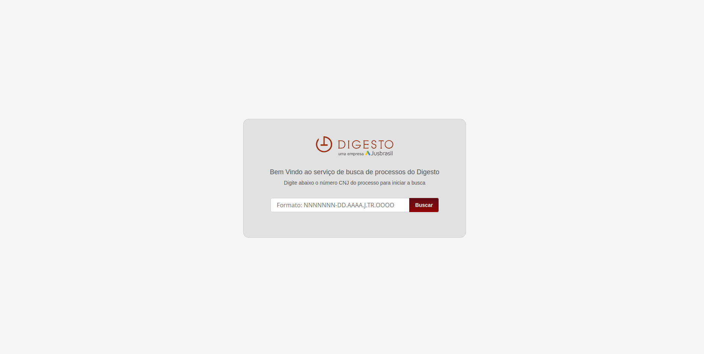
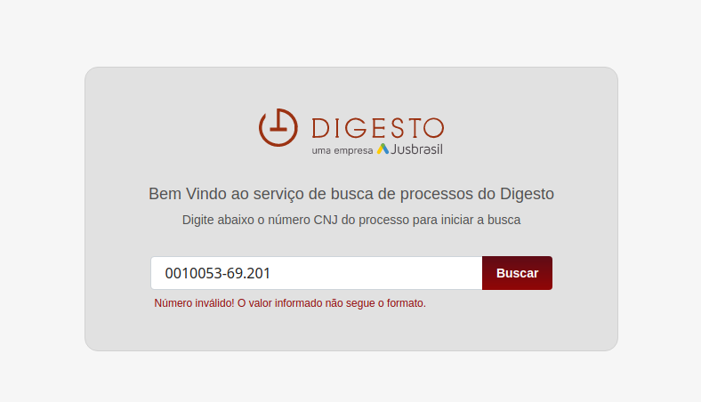
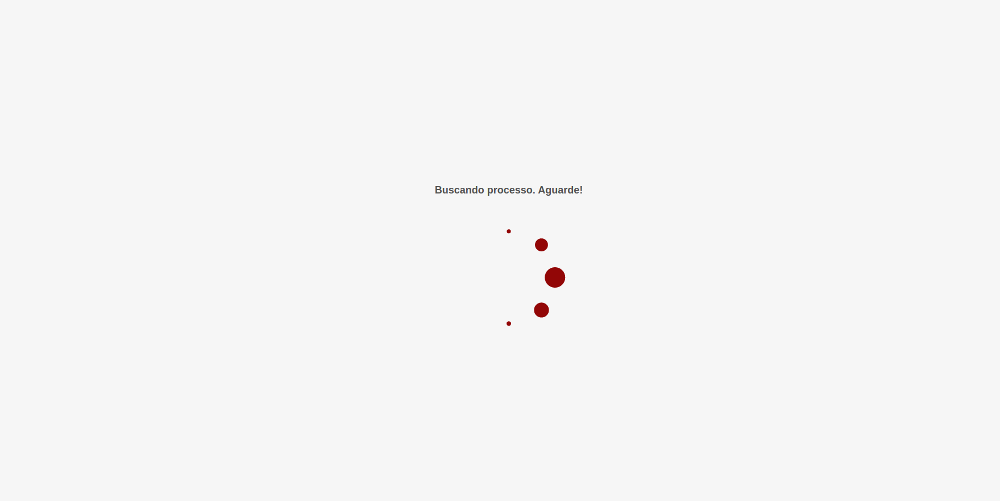
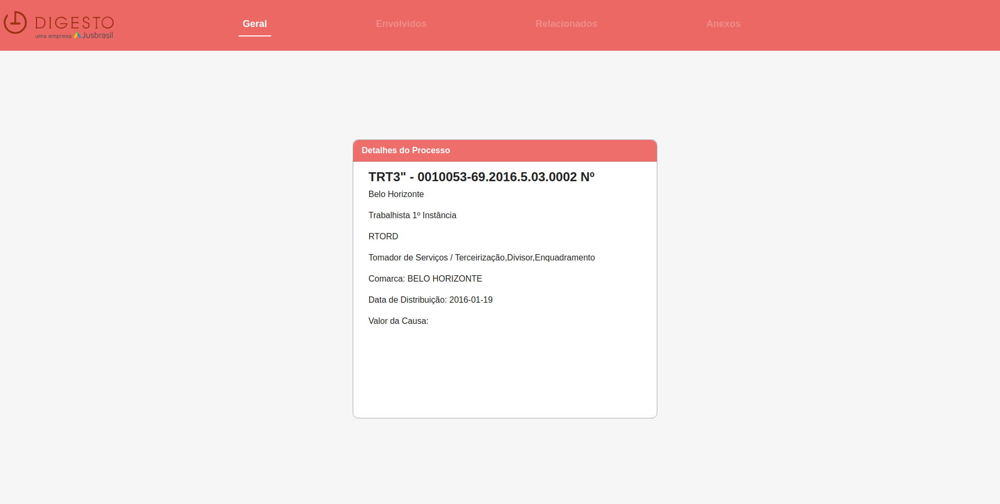
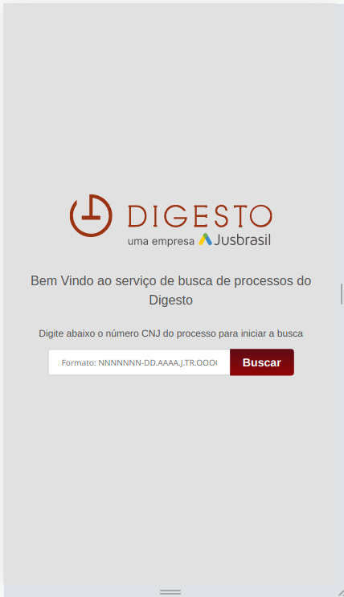
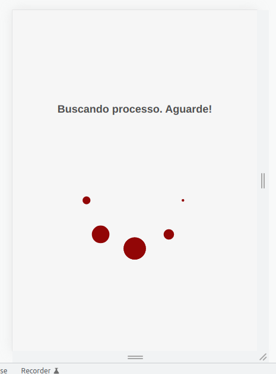
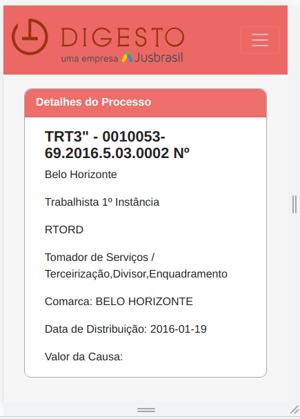

# test-digesto
Digesto technical test
## Estruturas Iniciais
Esta aplicação foi criada através do Create React App e gerenciado pelo Yarn. 
O primeiro coisa a se fazer é abrir o terminal, baixar o arquivo da aplicação,
abrir o console dentro da pasta da aplicação e adicionar o seguinte código:

'yarn' ou 'yarn install' - inicializa o download de todas as dependencias neces-
sárias para o funcionamento da aplicação. 

Caso o seu computador não reconheça o yarn o instale usando: 
npm install --global yarn

This project was bootstrapped with [Create React App](https://github.com/facebook/create-react-app).

Para o fluxo de navegação e gerenciamento de estados foi utilizado redux com o 
middleware redux-saga. Dessa forma, as ações e respostas do serviço se encontram[
mais organizados e limpos.
## Bibliotecas de destaque. (As demais se encontram no arquivo package.json).
### Para criar a arquitetura flux
    redux
    react-redux
    redux-saga

### rotas
    react-router
    react-router-dom

### Conexão API/REST
    axios

### customização, consulta e ajustes de desenvolvimento
    jquery
    react-devTool-extension
    react-loasing

## Telas 

 Tela inicial da aplicação 

 
Ao adicionar um valor considerado inválido no campo de busca

 
 Ao deixa o campo vazio.

 
 Buscando o processo.

 
 Tela com as informações do processo. Primeiramente, foi pensado em separar 
 as informações em 4 sessões porém devido ao tempo de produção optou-se por 
 agrupar uma quantidade de informações em somente uma. Tendo em vista que a
 data está salva no payload basta adicionar os demais elementos nas demais 
 sessões. 

 
 Também é possível fazer o processo de busca via mobile.

 
 Tela de carregamento.

 
 Tela de processos.

 ## Complicações de produção com erros CORS.

 Ao enviar as requisições via API sem a devida altorização do servidor acarretou os
 Erros CORS.

 Uma vez que a aplicação utiliza a API externa: https://op.digesto.com.br/api/ para 
 fazer as requisições dos dados do processo ela fica suscetível ao erro de
  CORS(https://developer.mozilla.org/pt-BR/docs/Web/HTTP/CORS).

Em geral as soluções para esse problema se dão no server-side, que enviaria no cabeçalho 
de resposta os campos permitindo acesso (Acess-Control-Allow-Credentials, 
Acess-Control-Allow-Origin, por exemplo).

Mas para fins de teste da aplicação podemos utilizar a extensão Allow CORS: 
Access-Control-Allow-origin https://mybrowseraddon.com/access-control-allow-origin.html 
para conseguir realizar as requisições.

developer.mozilla.org (https://developer.mozilla.org/pt-BR/docs/Web/HTTP/CORS)
Cross-Origin Resource Sharing (CORS) - HTTP | MDN
CORS - Cross-Origin Resource Sharing (Compartilhamento de recursos com origens diferentes) é um mecanismo que usa cabeçalhos adicionais HTTP para informar a um navegador que permita que um aplicativo Web seja executado em uma origem (domínio) com permissão para acessar recursos selecionados de um servidor em uma origem distinta. Um aplicativo Web executa uma requisição cross-origin HTTP ao solicitar um recurso que tenha uma origem diferente (domínio, protocolo e porta) da sua própria origem.
### `yarn start`

Runs the app in the development mode.\
Open [http://localhost:3000](http://localhost:3000) to view it in your browser.

The page will reload when you make changes.\
You may also see any lint errors in the console.

### `yarn test`

Launches the test runner in the interactive watch mode.\
See the section about [running tests](https://facebook.github.io/create-react-app/docs/running-tests) for more information.

